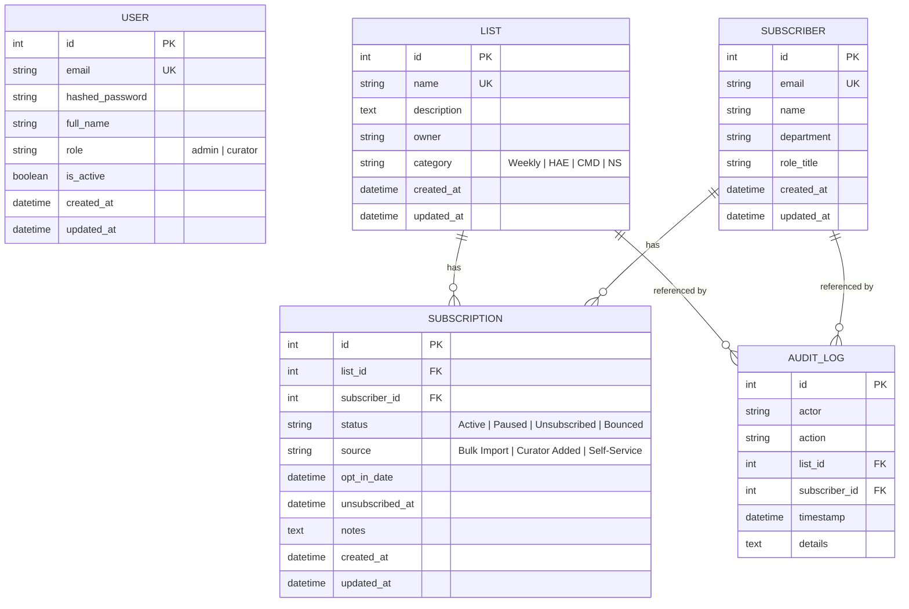

# Database Schema Documentation

The system uses a relational database managed through SQLAlchemy ORM. SQLite is used for local development; the schema is designed for compatibility with Azure SQL Database for production deployment.

## Entity Relationship Diagram

## Schema Entities

### 1. User (`users`)

Represents curators and administrators who manage the system.

| Column | Type | Constraints | Description |
|--------|------|-------------|-------------|
| `id` | Integer | PK, auto-increment | Primary key |
| `email` | String(255) | Unique, indexed, not null | Login identifier |
| `hashed_password` | String | Not null | bcrypt hash |
| `full_name` | String(255) | Nullable | Display name |
| `role` | String(50) | Default `"curator"` | `admin` or `curator` |
| `is_active` | Boolean | Default `true` | Account status |
| `created_at` | DateTime(tz) | Server default `now()` | Creation timestamp |
| `updated_at` | DateTime(tz) | Server default `now()`, auto-update | Last modification |

### 2. List (`lists`)

Represents a distribution channel (e.g., Weekly Newsletter, HAE, CMD, NS).

| Column | Type | Constraints | Description |
|--------|------|-------------|-------------|
| `id` | Integer | PK, auto-increment | Primary key |
| `name` | String(255) | Unique, indexed, not null | List display name |
| `description` | Text | Nullable | List description |
| `owner` | String(255) | Nullable | Responsible person |
| `category` | String(50) | Nullable | Channel type (Weekly/HAE/CMD/NS) |
| `created_at` | DateTime(tz) | Server default `now()` | Creation timestamp |
| `updated_at` | DateTime(tz) | Server default `now()`, auto-update | Last modification |

**Relationships:** One-to-many with `Subscription` (cascade delete).

### 3. Subscriber (`subscribers`)

Unique email contacts who can be subscribed to one or more distribution lists.

| Column | Type | Constraints | Description |
|--------|------|-------------|-------------|
| `id` | Integer | PK, auto-increment | Primary key |
| `name` | String(255) | Nullable | Display name |
| `email` | String(255) | Unique, indexed, not null | Email address |
| `department` | String(255) | Nullable | Organizational department |
| `role_title` | String(255) | Nullable | Job title |
| `created_at` | DateTime(tz) | Server default `now()` | Creation timestamp |
| `updated_at` | DateTime(tz) | Server default `now()`, auto-update | Last modification |

**Relationships:** One-to-many with `Subscription` (cascade delete).

### 4. Subscription (`subscriptions`)

Join entity linking a `Subscriber` to a `List`. Carries per-list subscription metadata.

| Column | Type | Constraints | Description |
|--------|------|-------------|-------------|
| `id` | Integer | PK, auto-increment | Primary key |
| `list_id` | Integer | FK → `lists.id` (CASCADE), not null | Target distribution list |
| `subscriber_id` | Integer | FK → `subscribers.id` (CASCADE), not null | Subscriber record |
| `status` | String(50) | Default `"Active"`, not null | `Active` / `Paused` / `Unsubscribed` / `Bounced` |
| `source` | String(50) | Default `"Bulk Import"`, not null | `Bulk Import` / `Curator Added` / `Self-Service` |
| `opt_in_date` | DateTime(tz) | Server default `now()` | When the subscriber was added |
| `unsubscribed_at` | DateTime(tz) | Nullable | When the subscriber unsubscribed |
| `notes` | Text | Nullable | Internal curator notes |
| `created_at` | DateTime(tz) | Server default `now()` | Record creation |
| `updated_at` | DateTime(tz) | Server default `now()`, auto-update | Last modification |

**Constraints:** Unique constraint on `(list_id, subscriber_id)` — a subscriber can only appear once per list.

**Relationships:** Many-to-one with both `List` and `Subscriber`.

### 5. AuditLog (`audit_logs`)

Immutable log of every subscriber-related modification made in the system.

| Column | Type | Constraints | Description |
|--------|------|-------------|-------------|
| `id` | Integer | PK, auto-increment | Primary key |
| `actor` | String(255) | Nullable | Email of the user who made the change |
| `action` | String(255) | Not null | Action description (e.g., "Subscriber added", "Subscriber removed", "List imported") |
| `list_id` | Integer | FK → `lists.id` (SET NULL), nullable | Associated list |
| `subscriber_id` | Integer | FK → `subscribers.id` (SET NULL), nullable | Associated subscriber |
| `timestamp` | DateTime(tz) | Server default `now()`, not null | When the action occurred |
| `details` | Text | Nullable | Additional context (e.g., "Bulk imported 15 subscribers from CSV.") |

**Relationships:** Many-to-one with `List` and `Subscriber` (SET NULL on delete to preserve audit history).

## Seeded Data

On first startup (`init_db.py`), the system seeds:

**Distribution Lists:**

| Name | Category | Owner |
|------|----------|-------|
| Weekly Newsletter | Weekly | Alex Sherman |
| HAE | HAE | Alex Sherman |
| CMD | CMD | Warren |
| NS | NS | Warren |

**Admin User:**

| Field | Value |
|-------|-------|
| Email | `curator@company.com` |
| Password | `securepassword123` |
| Full Name | Andrea Tang |
| Role | `admin` |
