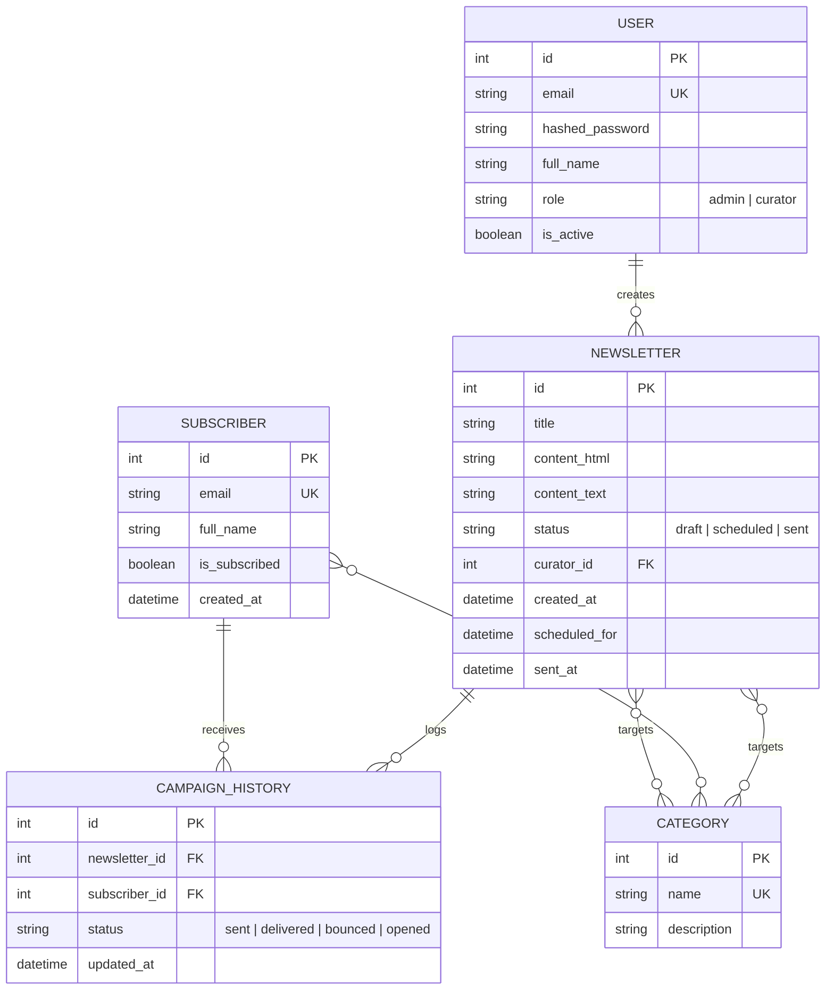

# Database Schema Documentation

The system uses a relational database schema (e.g., PostgreSQL or SQLite) managed through SQLAlchemy.

## Schema Entities

### 1. User
Represents curators and administrators managing the system.

### 2. Subscriber
Employees or contacts who receive updates.
- Many-to-many relationship with `Category` via a join table `subscriber_category`.

### 3. Category
Different topics of newsletters (e.g., *Product Updates*, *HR Announcements*).

### 4. Newsletter
Contains the email content, scheduling, state, and references the curator who created it.

### 5. Campaign History
Audit logs showing which newsletters were delivered to which subscribers, including status tracking (sent, opened, bounced).
